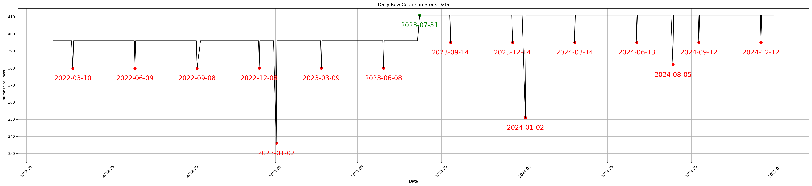
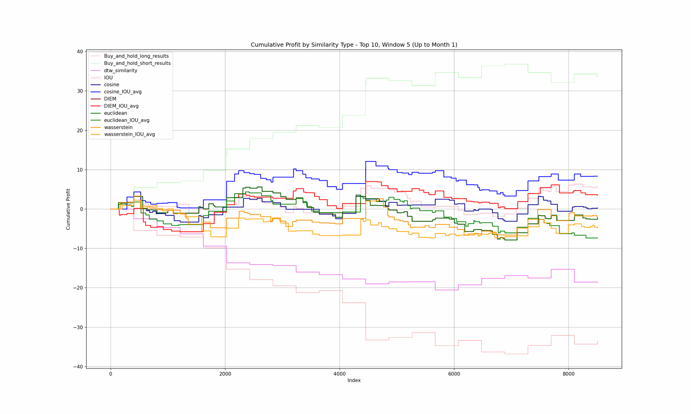

# PAST
**PAST : Price Analysis using Similarity Tracking**

## Concept of PAST

- **Current Chart** (**C**, 🔴): Historical charts similar to the current window
- **Future Chart** (**F**, 🟢): Future price movements of the chart (C) browsed based on similarities

**PAST is a model-learning-independent system that does not use the concept of model learning**

PAST uses images of `candlestick charts` and `Bollinger band areas` to make predictions and trades based on the similarity between the current window and the past window

## 🛠 System
- **CPU** `AMD Ryzen 9 5950X 16-Core Processor`
- **GPU** `NVIDIA GeForce RTX 4080`
- **Memory RAM** `128GB`

**The computational efficiency of PAST is proportional to the CPU's power(Logical processor)**

## 📑 Usage
### Requirments
- **python version** `3.8`
- **TA Library** `TA_Lib-0.4.24-cp38-cp38-win_amd64.whl`
- **Other packages** `Packages in common_imports.py`
- **Futures Data** `KOSPI200 Futures Data` 1-minute high-frequency trading data

### run.py
- To run the PAST system, the parser arguments must be passed using the `run.py` and `sh files`
- The `sh file` is divided into subfolders and multiple steps within the ./scripts/ folder.

#### The scripts folder structure is as follows:
```
./scripts/
├── data/
│     ├──01_data_preprocessing.sh
│     ├──02_numeric.sh
│     │         :
│     └──05_label_data.sh
│
├── Similarity/
│     ├──01_image_FE.sh
│     ├──02_image_similarity.sh
│     │         :
│
└── Backtesting/
      ├──01_results_merge.sh
      ├──02_prediction.sh
      │         :
```
#### Example command (Git Bash)
```
sh ./scripts/data/03_candlestick_image.sh
```
#### Example code in sh file
```
#!/bin/bash
python run.py \
    --task_name candlestick_image \
    --candel_dir ./data/img_data/candle_img/ \
    --stock_csv ./data/csv/stock_data.csv \
    --seq_len 60 \
    --window_len 5 \
    --end_date 2025-01-01 \
    --start_index 0 \
```


## 📊 Backtesting
#### KOSPI200 futures data
 

- **Experimental period** 2022.02.10-2024.12.31
- **Test(Trading)** 2024.01.01-2024.12.31

Each point in the `Test(Trading)` period time series has access to all of the previous time series

- **Specifics in data**
> 1. As of July 31, 2023, the opening hours of the derivatives market on the Korea Exchange have been accelerated due to changes in the derivatives market system `9 AM -> 8:45 AM`
> 2. Some days the market closes early at `3:20`
> 3. First trading day of the new year will have a 1-hour delayed opening time `2023Y: 9 AM -> 10 AM` `2024Y: 8:45 AM -> 9:45 AM`

#### Experimental setup
- **Window size** (default, 🔴)
    - 60
- **Window sliding** (default)
    - 5
- **Labeling window size** (🟢) 
    - 5, 10, 15, 30, 60 → **best💡** 15, 30
- **Select Top N instances**
    - 1, 3, 5, 10, 20, 30, 50, 100, 200 ... → **best💡** 1, 3, 30
- **Similarity types**
    - Candlestick image feature similarity → DIEM, Cosine, Euclidean, Wasserstein
    - Bollinger band area IOU score → IOU
    - Numeric feaure → Dtw


#### Summary of trading performance by similarity type

| **Category**   | **strategy**          | **total_payoff_ratio** | **total_profit_factor** | **long_payoff_ratio** | **long_profit_factor** | **short_payoff_ratio** | **short_profit_factor** | **final_cumulative_profit** | **final_cumulative_return** | **max_realized_profit** | **max_realized_return** | **final_portfolio_return** | **max_portfolio_return** | **MaxDrawdown** | **MaxDrawdown_rate** |
|----------------|-------------------------|-----------------------|------------------------|-----------------------|-----------------------|------------------------|------------------------|--------------------------|---------------------------|------------------------|---------------------|----------------------------|--------------------------|-----------------|--------------------|
| **similarity** | **IOU**                 | **1.273**             | **1.06**               | **1.218**             | **0.948**             | **1.326**             | **1.177**             | **17.037**               | **5.281**                 | **5.824**              | **1.704**           | **339.578**               | **5.281**                | **9.332**         | **-4.256**         |
|                | DIEM                    | 1.232                 | 1.007                  | 1.186                 | 0.913                 | 1.276                 | 1.102                 | 1.306                    | 0.404                     | 6.087                  | 1.757               | 323.83                    | 0.404                    | 6.345           | -5.815           |
|                | **DIEM_IOU_avg**        | **1.254**             | **1.052**               | **1.166**             | **0.965**             | **1.339**             | **1.137**             | **14.336**               | **4.446**                 | **6.146**              | **1.781**           | **336.722**               | **4.446**                | **7.673**         | **-4.71**          |
|                | cosine                  | 1.233                 | 1.009                  | 1.178                 | 0.903                 | 1.284                 | 1.119                 | 1.746                    | 0.541                     | 5.964                  | 1.727               | 324.267                   | 0.541                    | 6.275           | -6.206           |
|                | **cosine_IOU_avg**      | **1.256**             | **1.037**               | **1.159**             | **0.938**             | **1.352**             | **1.139**             | **10.224**               | **3.17**                  | **6.306**              | **1.831**           | **332.691**               | **3.17**                 | **7.353**         | **-4.911**         |
|                | euclidean               | 1.232                 | 1.007                  | 1.186                 | 0.913                 | 1.276                 | 1.102                 | 1.306                    | 0.404                     | 6.087                  | 1.757               | 323.83                    | 0.404                    | 6.345           | -5.815           |
|                | **euclidean_IOU_avg**   | **1.28**              | **1.061**               | **1.214**             | **0.976**             | **1.343**             | **1.145**             | **17.219**               | **5.341**                 | **6.188**              | **1.788**           | **339.624**               | **5.341**                | **8.107**         | **-4.677**         |
|                | wasserstein             | 1.247                 | 1.009                  | 1.208                 | 0.915                 | 1.283                 | 1.108                 | 1.284                    | 0.398                     | 6.022                  | 1.76                | 323.788                   | 0.398                    | 6.785           | -7.07            |
|                | **wasserstein_IOU_avg** | **1.277**             | **1.035**               | **1.221**             | **0.944**             | **1.331**             | **1.13**              | **9.508**                | **2.949**                 | **6.269**              | **1.829**           | **331.992**               | **2.949**                | **7.937**         | **-4.71**          |
| **Benchmark**  | dtw_similarity          | 0.864                 | 0.845                  | 0.859                 | 0.82                  | 0.568                 | 0.684                 | -29.532                  | -9.165                    | 5.217                  | 1.584               | 292.67                    | -9.165                   | 0               | -11.151          |
|                | long                    | 0.9                   | 0.76                   | 0.9                   | 0.76                  | 0                     | 0                     | -77.4                    | -24.241                 | 11.1                 | 3.284               | 241.9                     | -24.241                | 0               | -26.675          |


#### Cumulative profit visualization (top: all results, bottom: BEST)
<div align="center">
    
    <br>
    
</div>
